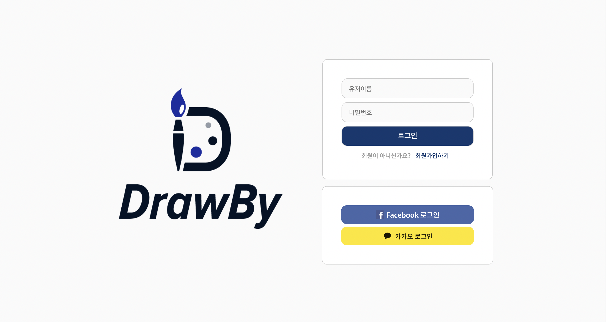
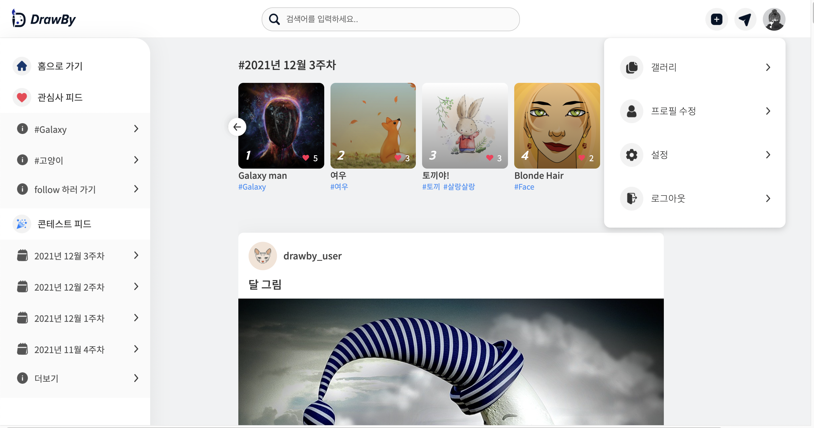
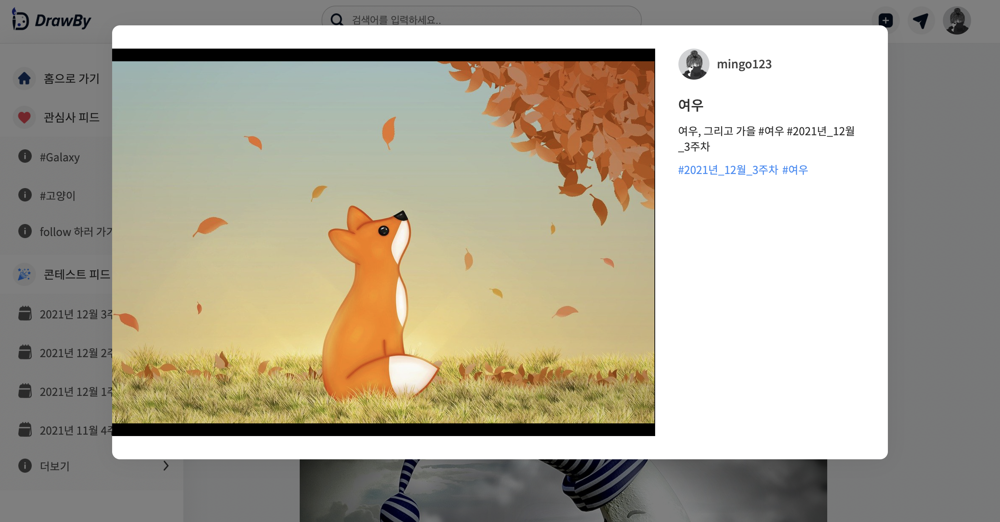
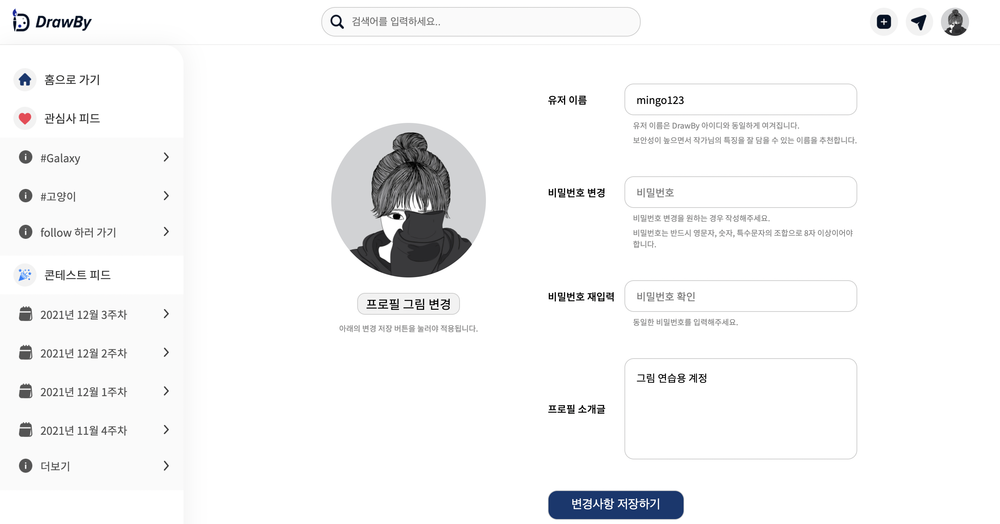
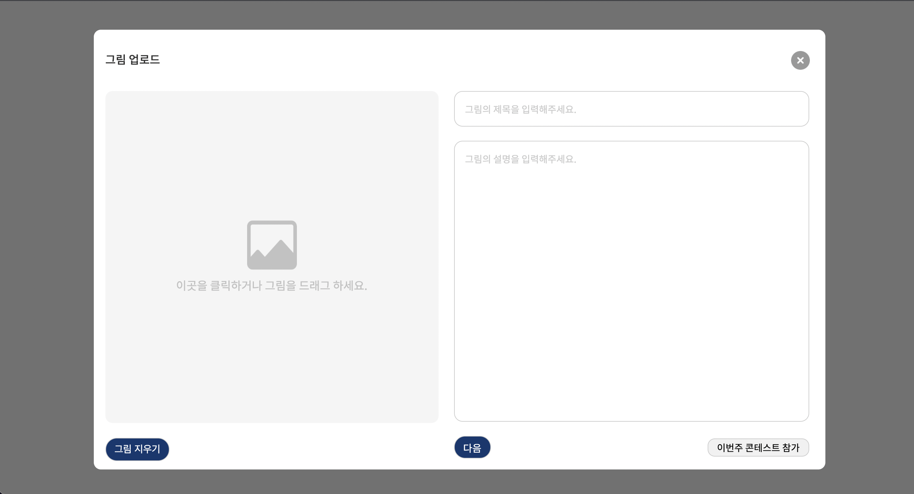
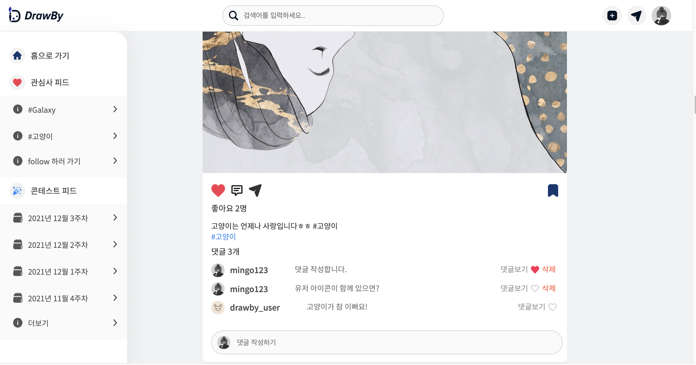
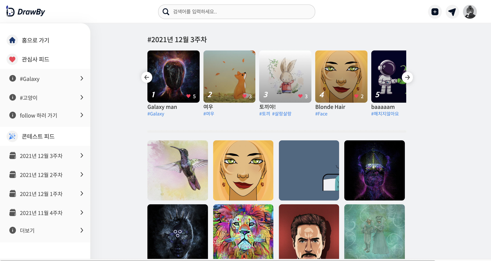
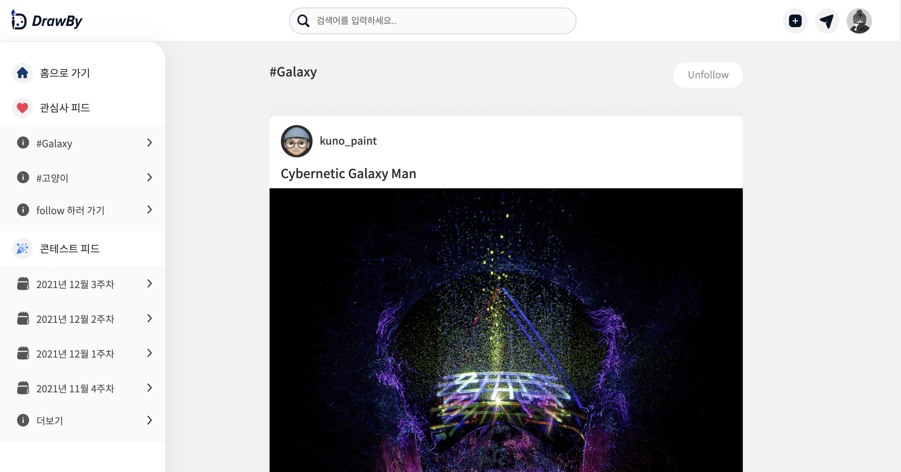
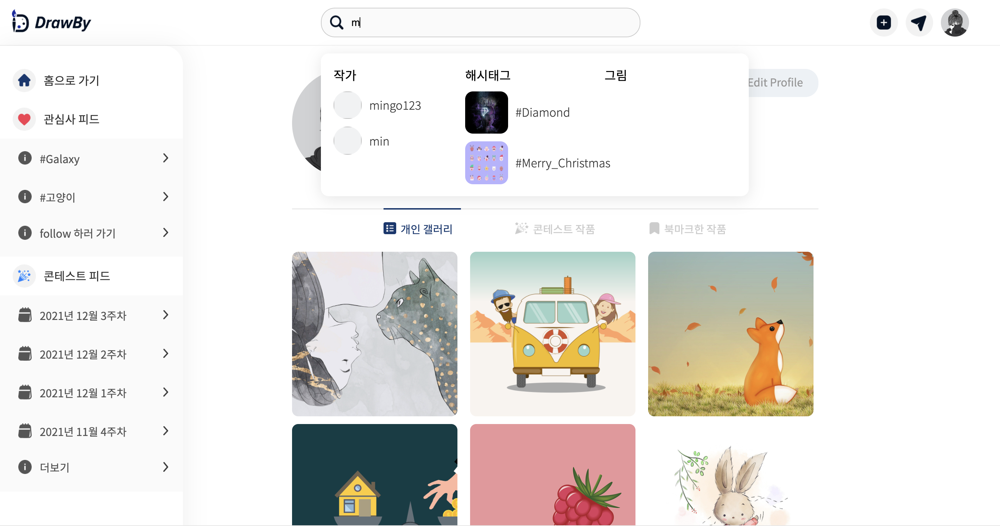
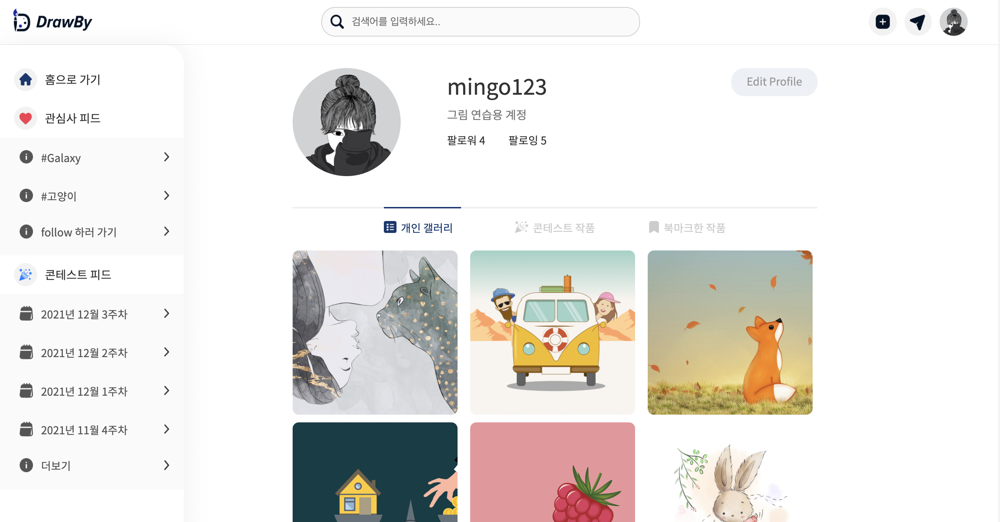

# **그림은 내 취미: DrawBy ✏️**

그림을 취미로 갖고 있는 사람들을 위한 SNS 플랫폼입니다.

ApolloGraphQL과 Prisma, PostgresQL을 활용하여 구성하였습니다.

**광주과학기술원 GSS 프로그램의 지원을 받아 제작하였습니다.**

## 기능

1. 로그인
   1. 일반 로그인 ( 아이디 + 비밀번호 )
   2. 소셜 로그인 ( kakao, facebook 구현)
2. 이미지
   1. 이미지 업로드 ( with drag & drop )
   2. 해시태그 등록
   3. 그림을 클릭하면 이미지가 팝업 형태로 크게 화면 중앙에 나타남
3. 피드
   1. 그 주의 컨테스트 작품들 상단에 전시
   2. 내가 팔로우한 유저들의 그림들이 피드에 나타남
   3. 댓글, 대댓글 가능
   4. 마음에 드는 그림을 북마크에 추가하기
4. 개인 갤러리
   1. 개인 갤러리, 콘테스트 작품, 북마크한 작품으로 나누어짐
   2. 개인갤러리에는 본인이 포스팅한 그림들이 나타난다.
   3. 콘테스트 작품은 그림 업로드시 콘테스트에 참여했던 것들이 나타난다. (수상여부 추가 필요)
   4. 북마크한 작품에는 북마크 처리한 그림들이 모아져있다.
5. 팔로우
   1. 유저 팔로우 이외에도 해시태그 팔로우를 통해 관심사를 등록할 수 있다.

## Display

## 로그인 페이지

## 메인 페이지

## 기본적으로 그림을 클릭하면 팝업창으로 크게 띄워짐

## 프로필 수정 페이지

그림 업로드 페이지,

## 이번주 콘테스트 참가 버튼을 눌러 업로드를 하면 현재 진행되고 있는 컨테스트가 해쉬태그로 달려 이미지가 업로드된다. ex) #2021년12월3주차

## 피드 형태

## 컨테스트 피드

## 해쉬태그 피드

## 검색 화면

## 나의 갤러리

## 데모

